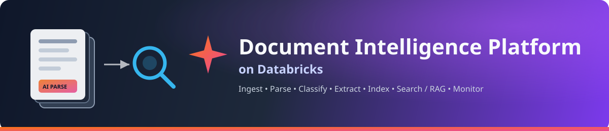
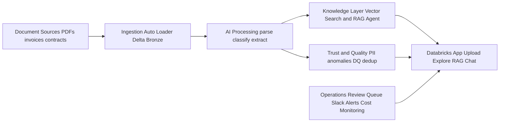
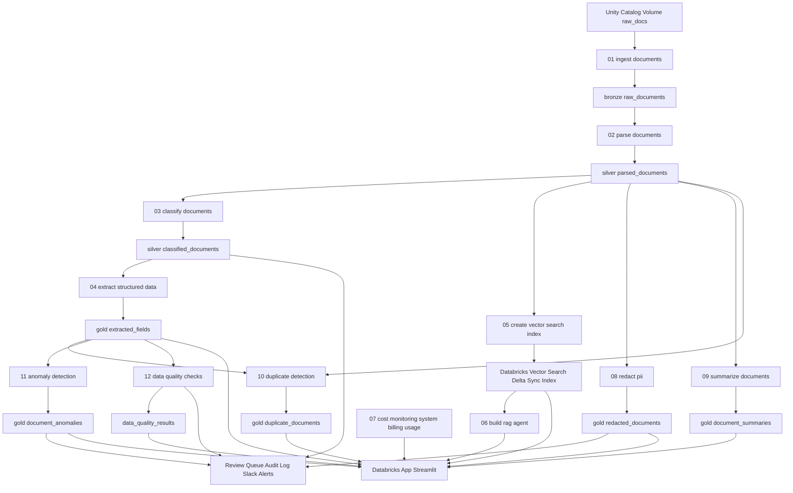

<p align="center">
  
</p>

<p align="center">
  
  
  
  
  
</p>

<h1 align="center">Document Intelligence Platform on Databricks</h1>

<p align="center">
A Databricks-native re-implementation of a Snowflake-Cortex-style document
intelligence pipeline: <b>ingest → parse → classify → extract → index → search
/ RAG chat → dashboard</b>, built entirely with Databricks primitives.
</p>

<a id="table-of-contents"></a>

## 📚 Table of contents

- [What's new — extended feature set](#whats-new--extended-feature-set)
- [Architecture](#architecture)
- [Mapping from Snowflake Cortex AI → Databricks](#mapping-from-snowflake-cortex-ai--databricks)
- [Repo layout](#repo-layout)
- [Prerequisites](#prerequisites)
- [Quickstart](#quickstart)
- [Notebook-by-notebook](#notebook-by-notebook)
- [Extending](#extending)

## What's new — extended feature set

Beyond the core parse → classify → extract → search/RAG pipeline, this
build adds a second wave of production-oriented capabilities:

| Feature | Where | What it does |
| --- | --- | --- |
| 🔒 **PII detection & redaction** | `notebooks/08_redact_pii.py`, `src/doc_intelligence/redaction.py` | Regex + LLM pass over parsed text; writes a shareable redacted copy to `gold_redacted_documents`, auto-enqueues PII-positive docs for review, and Slack-alerts |
| 📝 **Summarization** | `notebooks/09_summarize_documents.py` | Executive summary, key points, and sentiment per document via `ai_query()` → `gold_document_summaries`, surfaced in the Explore tab |
| 🧬 **Duplicate detection** | `notebooks/10_duplicate_detection.py`, `src/doc_intelligence/dedup.py` | Exact-hash matching + Vector-Search-based near-duplicate detection → `gold_duplicate_documents` |
| 📊 **Anomaly detection** | `notebooks/11_anomaly_detection.py`, `src/doc_intelligence/anomaly.py` | Z-score amount outliers, duplicate invoice numbers, future-dated documents, missing required fields → `gold_document_anomalies`, auto-enqueued for review and Slack-alerted at high severity |
| ✅ **Data quality checks** | `notebooks/12_data_quality_checks.py`, `src/doc_intelligence/quality.py` | Explicit field-level checks (non-null vendor, valid currency, non-negative amount, valid JSON, etc.) → `data_quality_results` |
| 🧑‍⚖️ **Human-in-the-loop review queue** | `review_queue` table, app's **Review Queue** tab | Low-confidence classifications, anomalies, and PII findings land in a queue reviewers can approve, reject, or correct from the app |
| 🔔 **Slack alerting** | `src/doc_intelligence/alerts.py` | High-severity anomalies and PII findings post to a Slack incoming webhook (`slack_webhook_url` bundle variable) |
| 🛡️ **Governance / RBAC example** | `setup/04_governance_grants.sql` | Unity Catalog grants by role (pipeline service principal, analysts, reviewers, compliance) plus a column-mask example on raw text |
| 📜 **Audit log** | `audit_log` table | Append-only trail of pipeline events per document |
| 🔁 **Reprocessing CLI** | `scripts/reprocess_documents.py` | Clears downstream rows for specific `doc_id`s (or all failed parses) and optionally re-triggers the job |
| ⚙️ **CI/CD** | `.github/workflows/ci.yml` | Runs unit tests + `databricks bundle validate` on PRs, `bundle deploy -t prod` on merge to `main` |

> 💡 **The Databricks App has six tabs:** Upload · Explore · RAG Chat ·
> Review Queue · Anomalies & Duplicates · Cost Monitor.

## Architecture

### Executive view



### Detailed dataflow

<details>
<summary>Click to expand the full notebook-level dataflow diagram</summary>



</details>

### Plain-text fallback

If Mermaid is unavailable, use this architecture summary:

1. Source and ingest
   - Documents land in Unity Catalog Volume at `/Volumes/doc_intel/pipeline/raw_docs`.
   - `01_ingest_documents` uses Auto Loader to write `bronze.raw_documents`.

2. Core AI pipeline
   - `02_parse_documents` uses `ai_parse_document()` and writes `silver.parsed_documents`.
   - `03_classify_documents` uses `ai_query()` and writes `silver.classified_documents`.
   - `04_extract_structured_data` uses `ai_query()` with schema output and writes `gold.extracted_fields`.

3. Search and RAG
   - `05_create_vector_search_index` builds a Delta Sync Vector Search index from parsed content.
   - `06_build_rag_agent` creates and deploys the Mosaic AI RAG agent.

4. Quality, compliance, and enrichment
   - `08_redact_pii` writes `gold.redacted_documents`.
   - `09_summarize_documents` writes `gold.document_summaries`.
   - `10_duplicate_detection` writes `gold.duplicate_documents`.
   - `11_anomaly_detection` writes `gold.document_anomalies`.
   - `12_data_quality_checks` writes `data_quality_results`.

5. Operations and user app
   - Review queue, audit log, and Slack alerts are fed from classification, PII, anomaly, and data quality outputs.
   - `07_cost_monitoring` reads `system.billing.usage` for platform cost visibility.
   - Databricks App (`app/app.py`) surfaces Upload, Explore, RAG Chat, Review Queue, Anomalies and Duplicates, and Cost Monitor.

## Mapping from Snowflake Cortex AI → Databricks

| Snowflake Cortex AI | Databricks equivalent |
| --- | --- |
| Internal/External Stage | Unity Catalog Volume |
| `AI_PARSE_DOCUMENT` (LAYOUT/OCR) | `ai_parse_document()` SQL function |
| Serverless Tasks / Streams | Databricks Workflows + Auto Loader (streaming) |
| `AI_CLASSIFY` | `ai_query()` against a served LLM with a classify prompt |
| Structured extraction functions | `ai_query()` with a JSON-schema response format |
| `CORTEX_SEARCH` service | Databricks Vector Search (Delta Sync Index) |
| Cortex Agents | Mosaic AI Agent Framework (`agents` SDK) |
| Streamlit-in-Snowflake dashboard | Databricks Apps (Streamlit) |
| Credit/cost dashboard | `system.billing.usage` system table |

## Repo layout

```text
setup/            SQL to create catalog, schema, volumes, Delta tables
notebooks/        Numbered pipeline notebooks (run in order, or via the job)
jobs/             Databricks Workflow (Job) definition, YAML
src/doc_intelligence/  Reusable Python helpers imported by the notebooks
app/              Databricks App (Streamlit) — dashboard + RAG chat UI
databricks.yml    Databricks Asset Bundle — deploys jobs + app in one shot
pyproject.toml    Local/dev dependencies and uv project config
```

## Prerequisites

- A Databricks workspace on **Unity Catalog** with:
  - Serverless SQL warehouse (for `ai_parse_document` / `ai_query`)
  - Vector Search enabled
  - Model Serving enabled (uses a pay-per-token foundation model endpoint,
    e.g. `databricks-meta-llama-3-3-70b-instruct` or `databricks-claude-sonnet-4`)
- Databricks CLI ≥ 0.230 with a configured profile (`databricks auth login`)
- Permission to create catalogs/schemas, or an existing catalog to target

## Quickstart

### Local development commands

```powershell
powershell -ExecutionPolicy Bypass -File .\scripts\local-dev.ps1 -Command sync
powershell -ExecutionPolicy Bypass -File .\scripts\local-dev.ps1 -Command test
powershell -ExecutionPolicy Bypass -File .\scripts\local-dev.ps1 -Command app
```

These wrappers call the uv-managed environment and keep the repo commands simple on Windows.

1. Install the project dependencies with uv.

   ```bash
   uv sync
   ```

   This creates the repo-local environment and keeps the package list in one
   place via `pyproject.toml`.

2. Configure `databricks.yml` and set `catalog`/`schema` variables (defaults: `doc_intel` / `pipeline`).

3. Deploy with the Databricks Asset Bundle.

   ```bash
   uv run databricks bundle validate
   uv run databricks bundle deploy -t dev
   ```

   This creates the job `document_intelligence_pipeline` and deploys the
   Streamlit app, using the notebooks/app files in this repo as source.

4. Bootstrap the schema (one-time, run `setup/00_create_catalog_schema.sql`
   through `setup/02_create_tables.sql` in a SQL editor, or let the first job
   task do it — see `jobs/document_pipeline_job.yml`).

5. Drop documents into the Volume.

   ```bash
   uv run databricks fs cp ./my_invoices/ dbfs:/Volumes/doc_intel/pipeline/raw_docs/ --recursive
   ```

6. Run the pipeline.

   ```bash
   uv run databricks bundle run document_intelligence_pipeline -t dev
   ```

7. Run the app locally for dry validation.

   ```bash
   uv run streamlit run app/app.py --server.headless true --server.port 8501
   ```

8. Open the app (URL printed by `bundle deploy`) to upload documents,
   browse extracted fields, chat with the RAG agent over your document
   corpus, and view the cost dashboard.

## Notebook-by-notebook

| # | Notebook | What it does |
| --- | --- | --- |
| 01 | `01_ingest_documents.py` | Auto Loader stream: Volume → `bronze.raw_documents` (binary + metadata) |
| 02 | `02_parse_documents.py` | Calls `ai_parse_document()` in LAYOUT mode → `silver.parsed_documents` (text, pages, tables as JSON) |
| 03 | `03_classify_documents.py` | `ai_query()` zero-shot classifier (invoice / contract / resume / report / other) → `silver.classified_documents` |
| 04 | `04_extract_structured_data.py` | Per-document-type JSON schema extraction via `ai_query()` → `gold.extracted_fields` |
| 05 | `05_create_vector_search_index.py` | Chunks parsed text, creates/refreshes a Delta Sync Vector Search index |
| 06 | `06_build_rag_agent.py` | Defines and logs a RAG agent (MLflow) that queries the vector index + serving endpoint, registers it to Unity Catalog and deploys a serving endpoint |
| 07 | `07_cost_monitoring.py` | Aggregates `system.billing.usage` filtered to this pipeline's compute/serving tags |
| 08 | `08_redact_pii.py` | Regex + LLM PII detection/redaction → `gold.redacted_documents`, review queue, Slack alert |
| 09 | `09_summarize_documents.py` | Executive summary / key points / sentiment → `gold.document_summaries` |
| 10 | `10_duplicate_detection.py` | Exact-hash + embedding near-duplicate detection → `gold.duplicate_documents` |
| 11 | `11_anomaly_detection.py` | Statistical + rule-based anomaly checks → `gold.document_anomalies`, review queue, Slack alert |
| 12 | `12_data_quality_checks.py` | Field-level DQ checks → `data_quality_results`; enqueues low-confidence classifications for review |
| 13 | `13_duplicate_detection_benchmark.py` | Synthetic benchmark comparing baseline vs optimized near-duplicate detection flow |

`scripts/reprocess_documents.py` — CLI to clear downstream rows for specific `doc_id`s (or every failed parse) and re-trigger the job.

<details>
<summary><strong>Reprocessing examples</strong> (click to expand)</summary>

```bash
# Inspect generated DELETE statements only
python scripts/reprocess_documents.py \
   --warehouse-id <warehouse-id> \
   --doc-ids abc123,def456 \
   --dry-run

# Reprocess failed parses with larger DELETE batches
python scripts/reprocess_documents.py \
   --warehouse-id <warehouse-id> \
   --all-failed-parses \
   --batch-size 1000

# Clear rows, then trigger a pipeline job run
python scripts/reprocess_documents.py \
   --warehouse-id <warehouse-id> \
   --doc-ids abc123 \
   --trigger-job 123456789
```

Notes:

- `--batch-size` controls DELETE chunking to avoid very large `IN (...)` clauses.
- For `gold_duplicate_documents`, rows are removed when either `doc_id` or `duplicate_of_doc_id` matches the requested document ids.

</details>

### Run benchmark on demand

The benchmark notebook is wired as a separate manual job so hourly/file-arrival pipeline runs are not impacted.

```bash
databricks bundle run document_intelligence_benchmark -t dev
```

## Extending

- Swap the classifier/extraction prompts in `src/doc_intelligence/classification.py`
  and `extraction.py` for your own document types and schemas.
- Add row/column level ACLs via Unity Catalog grants on `gold.extracted_fields`
  for governed access, same as Snowflake's role-based grants.
- Point Auto Loader at cloud storage (S3/ADLS/GCS) directly instead of a
  Volume for a fully "documents stay in object storage" pattern.

---

<p align="center">
  <a href="#table-of-contents">⬆ Back to top</a>
</p>
